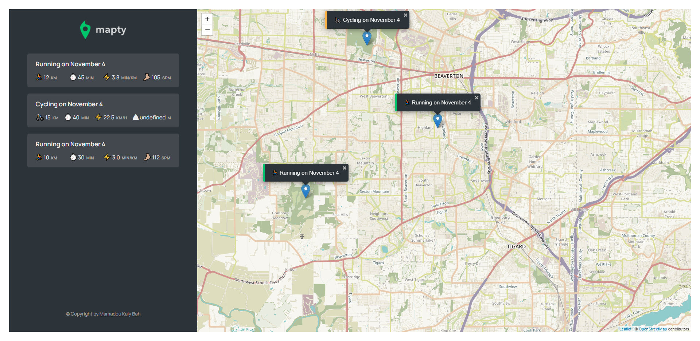

# MAPTY PROJECT

This is a app that will help you map your workouts. Using Javascript and its libraries to build it.
this project was part of complete-javascript-course by jonas schmedtmann on Udemy.



## Technologies and Libraries

- [leaflet](https://leafletjs.com/): open-source javascript library for mobile-friendle interactive maps

```
var map = L.map('map').setView([51.505, -0.09], 13);
L.tileLayer('https://{s}.tile.openstreetmap.org/{z}/{x}/{y}.png', {
attribution: '&copy; <a href="https://www.openstreetmap.org/copyright">OpenStreetMap</a> contributors'
}).addTo(map);

L.marker([51.5, -0.09]).addTo(map)
.bindPopup('A pretty CSS3 popup.<br> Easily customizable.')
.openPopup();

```

## Futur Upgrade

- Ability to edit a workout;
- Ability to delete a workout;
- Ability to delete all workouts;
- Ability to sort workouts by a certain field (e.g. distance);
- Re-build the error and confirmation messages;
- Ability to position the map to show all workouts;
- Ability to draw lines and shapes instead of just point;
  Using Different Libraries you can:
- Geocode location from coordinates ("Run in Faro, Portugal")
- Display weather data from workout time and place

## LICENSE

[MIT License](LICENSE)
